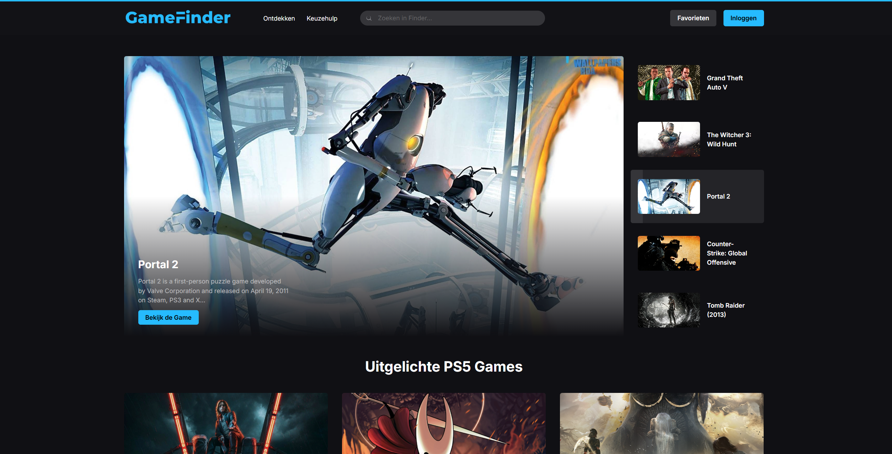

# GameFinder - Installatiehandleiding

## Inhoudsopgave


1. [Inleiding](#inleiding)
2. [Screenshots](#screenshots)
3. [Benodigdheden](#benodigdheden)
4. [De applicatie draaien](#de-applicatie-draaien)
5. [Overige commando's](#overige-commandos)
6. [Testgebruikers](#testgebruikers)

## Inleiding


GameFinder is een webapplicatie gebouwd met [React](https://react.dev/) waarmee gebruikers games kunnen ontdekken, filteren en opslaan. De applicatie maakt gebruik van de [RAWG Video Games Database API](https://rawg.io/apidocs) voor game-informatie en de [NOVI Dynamic API](https://novi-backend-api-wgsgz.ondigitalocean.app/) voor gebruikersbeheer en favorieten.

### Belangrijkste functionaliteiten:

* **Registreren en inloggen**: Gebruikers kunnen een account aanmaken en inloggen om toegang te krijgen tot de persoonlijke favorietenlijst.

* **Games ontdekken**: Gebruikers kunnen bladeren door duizenden games met geavanceerde filters op genre, platform en kenmerken.

* **Keuzehulp**: Gebruikers kunnen hulp krijgen bij het filteren van de games door middel van het beantwoorden van een korte vragenlijst.

* **Favorieten**: Ingelogde gebruikers kunnen favoriete games opslaan en beheren vanaf elk apparaat met behulp van een gebruikersaccount.

## Screenshots


*De homepage van GameFinder toont populaire games en een overzicht van uitgelichte PlayStation 5 games.*


## Benodigdheden


Om de webapplicatie te starten moet de volgende software op je systeem geïnstalleerd zijn:

### Software vereisten:

* **Node.js** - (versie v22.14.0 of hoger): [Download hier](https://nodejs.org/)
* **npm** - (versie 11.6.1 of hoger, wordt automatisch geïnstalleerd met Node.js)
* **Git** - (optioneel, voor het klonen van de repository): [Download hier](https://git-scm.com/)

### Externe diensten:

* **RAWG API Key** - Gratis aan te vragen via [RAWG Video Games Database API](https://rawg.io/apidocs)
* **NOVI Dynamic API** - Gratis voor Novi studenten via [NOVI Dynamic API](https://novi-backend-api-wgsgz.ondigitalocean.app/)

### Gebruikte frameworks en libraries:

* **React** 19.1.1
* **React Router DOM** 7.9.2
* **Axios** 1.12.2
* **Vite** 7.1.7
* **jwt-decode** 4.0.0
* **Jest** 30.1.3 (voor testing)
* **ESLint** 9.36.0 (voor codekwaliteit)

## De applicatie draaien


### Stap 1: Download het project

Als je het project nog niet hebt, download dan de ZIP-file en pak deze uit, of kloon de repository met Git in de terminal:

```bash


git clone https://github.com/alexanderkiggen/Eindopdracht-Frontend
cd Eindopdracht-Frontend
```

### Stap 2: Installeer dependencies

Open een terminal in de projectmap en voer het volgende commando uit om alle benodigde packages te installeren:

```bash


npm install
```

Dit proces kan enkele minuten duren. Er worden meer dan 300 packages geïnstalleerd.

### Stap 3: Configureer omgevingsvariabelen

In de root van het project moet een bestand worden toegevoegd met de naam `.env`. Dit bestand bevat alle geheime sleutels inclusief URI's. **Let op**: De RAWG API key en NOVI project key zijn al ingevuld in het meegeleverde `.env` bestand in Microsoft Teams. Je hoeft zelf GEEN API keys aan te maken.

Het `.env` bestand bevat de volgende variabelen:

```env
VITE_BASE_URL=https://api.rawg.io/api
VITE_API_KEY=jouw-rawg-api-key-hier
VITE_NOVI_PROJECT_URL=https://api.datavortex.nl/gamefinder
VITE_NOVI_PROJECT_KEY=jouw-novi-project-key-hier
```

### Stap 4: Configureer de NOVI Dynamic API

De applicatie gebruikt de NOVI Dynamic API voor gebruikersbeheer en favorieten. Het JSON-configuratiebestand (`novi-api-config.json`) is al meegeleverd in Microsoft Teams.

**Belangrijke stappen**:

1. Ga naar de NOVI Dynamic API: [Dashboard](https://novi-backend-api-wgsgz.ondigitalocean.app/)
2. Voeg bij "API Configureren" het project ID in te vinden in het `.env` bestand onder `VITE_NOVI_PROJECT_KEY`
3. Upload het `novi-api-config.json` bestand via de "Bestand kiezen" optie
4. Klik vervolgens op "Upload API configuratie"

### Stap 5: Start de development server

Voer het volgende commando uit in de terminal om de applicatie te starten:

```bash


npm run dev
```

De applicatie start nu op onder `http://localhost:5173/`

## Overige commando's


Naast het standaard development commando zijn er nog andere npm commando's beschikbaar:

### Build voor productie

```bash


npm run build
```

Dit commando compileert de applicatie voor productie. De geoptimaliseerde bestanden worden geplaatst in de `dist/` map. Deze bestanden kunnen worden geüpload naar een webserver.

### Preview productie build

```bash


npm run preview
```

Na het uitvoeren van `npm run build` kun je de productie-versie lokaal testen met dit commando.

## Testgebruikers


De NOVI Dynamic API is vooraf geconfigureerd met twee testgebruikers. Er is geen verschil tussen admin en normale gebruiker accounts. Je kunt direct inloggen met onderstaande gegevens:

### Account 1:

* **E-mail**: `admin@novi.nl`
* **Wachtwoord**: `admin123`

### Account 2:

* **E-mail**: `gebruiker@novi.nl`
* **Wachtwoord**: `user123`

### Nieuw account aanmaken

Je kunt ook een nieuw account aanmaken via de "Registeren hier" optie op de inlog pagina.

**Let op**:

* Wachtwoorden moeten minimaal 6 tekens bevatten
* E-mailadressen moeten een geldig formaat hebben
* Elk e-mailadres kan maar één keer worden gebruikt
